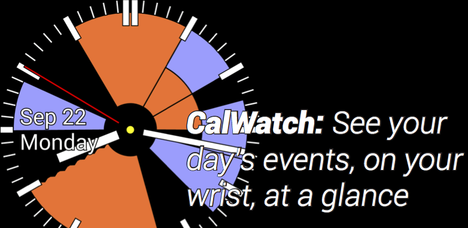

* Copyright (C) 2014-2018 by Dan Wallach
* Home page: http://www.cs.rice.edu/~dwallach/calwatch/
* Licensing: http://www.cs.rice.edu/~dwallach/calwatch/licensing.html

## tl;dr

CalWatch2 is an open-source WearOS watchface, compatible with WearOS 1.x and 2.x, that reads your calendar
and renders the next twelve hours of your schedule around the face of the watch. CalWatch2
is mostly implemented in the Kotlin programming language.

## What's where

* notes.txt -- ongoing work, notes, to-do items, etc.

* /images -- screen dumps and assorted graphics

    * note: "resample.csh", at the top level, starts from a
      high-resolution screen dump and generates preview images at all
      the correct resolutions; these downstream dependencies are all
      checked in, so unless you're changing the the icon, you don't
      need to rerun this csh script. Also note that you'll need the
      Imagemagick package installed to run it.)

    * For most things, I'm now using the vector / scalable image types
      supported by Android. You'll find PDFs (drawn in Illustrator) here,
      and SVG output from that, which is then digestible by Android Studio.

* /logdumps -- logcat plus notes from the various times that CalWatch has blown up

* /app -- the unifed app that runs on Wear watches
    * src/androidTest/java/ -- some old unit tests for event layout
    * src/main/kotlin/ -- CalWatch source-code files
        * org.dwallach.calwatch/ -- CalWatch Kotlin files
        * org.dwallach.complications/ -- based on the Android sample code and heavily modified

    * src/main/java/EDU.Washington.grad.gjb.cassowary -- the Cassowary linear constraint solver
        * The code here is essentially unchanged from the original
          (http://sourceforge.net/projects/cassowary/), but with
          tweaks to compile under newer Java versions, including
          updates to use the newer parametric HashMap versus the
          older non-parametric Hashtable.

If you look at code prior to release4, you'll see that this project was written entirely in Java.
Starting with release4, I ported most everything to Kotlin and did a ton of code cleanup. release5
features a complete redesign of the user preferences panel, running on the phone, with the latest Material
Design styling. Shortly thereafter, at I/O 2016, Google announced WearOS 2 which, of course,
completely changed how the phone and the watch relate to one another. Fast forward to I/O 2017 and
Google announced they were providing sample code and libraries to make it much easier to support
complications, plus they're finally rolling out Wear 2 to more watches. Consequently, release6
now supports Wear 2.x watches, moving all the configuration dialogs away from the phone and doing
everything on the watch. release6 also uses the latest Kotlin coroutine support to do the expensive
calendar processing asynchronously.

## Credit where credit is due:

* Cassowary linear constraint solver by Greg J. Badros and Alan Borning
  https://constraints.cs.washington.edu/cassowary/

* "Unavailable calendar" icon by Björn Andersson
  ttp://www.flaticon.com/authors/google
